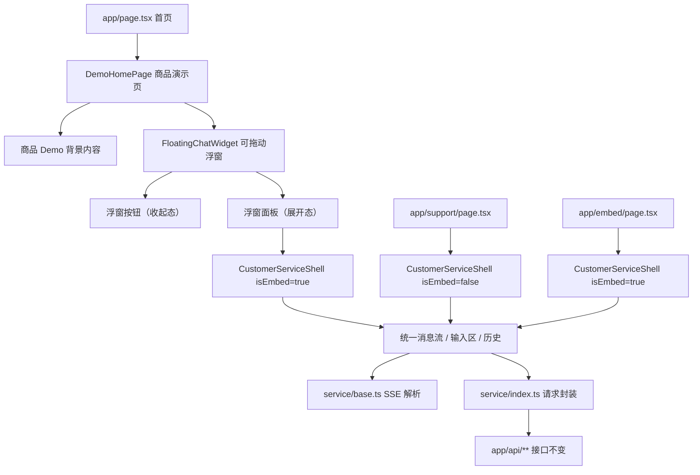

## 用户需求

- 将网站首页（`/`）改造为"部署效果演示页"：模拟一个真实的商品/SaaS 页面，右下角带有可拖动的智能客服聊天浮窗，让访问者直接体验"把这个客服模板部署到自己网站后是什么效果"。
- 客服浮窗支持拖动位置，点击右下角按钮展开聊天面板，面板可在页面上自由拖拽。
- 保留 `/embed` 作为纯客服入口（给 iframe 嵌入用的紧凑页面，只有对话界面）。
- 保留 `/support`（或当前 `/cool` 兼容入口）作为完整页客服入口，独立全屏访问。
- 现有 API 接口全部保持不变，不改动任何接口地址、请求结构、响应结构和流式事件语义。
- 整理修改后网站中用不到的旧模块删除计划。

## 产品概述

- 首页是整个网站模板产品的核心展示页面：背景是一个模拟的商品页面（品牌导航、商品卖点、价格、规格、FAQ、购买按钮等），右下角叠加一个可拖动的智能客服聊天浮窗。
- 用户打开首页就能立即体验到"部署后智能客服嵌入自己网站的真实效果"。
- 客服浮窗内部复用已有的统一客服壳（`CustomerServiceShell`），支持 chat / agent / workflow 统一展示。

## 核心功能

- 首页商品 Demo 背景页面：品牌区、商品主视觉、核心卖点、规格亮点、FAQ、购买行动入口。
- 右下角悬浮客服按钮，点击展开可拖动的聊天面板。
- 聊天面板内部复用统一客服壳，兼容 chat、agent、workflow。
- `/embed` 保持为纯客服 iframe 入口。
- `/support` 保持为完整页客服入口。
- 旧模块分阶段删除计划。

## 技术栈

- 现有项目技术栈保持不变：Next.js App Router、React 19、TypeScript、Tailwind CSS、CSS Modules。
- 国际化继续沿用 `i18n/*`。
- 服务访问与流式解析继续复用 `service/index.ts`、`service/base.ts`。
- 现有 `app/api/**/route.ts` 全部冻结不改。

## 实现方案

核心策略是"只换首页壳，不换客服核心与 API 契约"。

### 方案边界

能改的：

- `app/page.tsx`：从直接渲染客服壳改为渲染商品 Demo 效果演示页。
- `app/components/nav-bar/`：导航栏适配新的页面结构。
- 新增首页商品 Demo 组件与可拖动客服浮窗组件。

不能改的：

- `app/api/*` 全部路径、请求、响应、SSE 事件。
- `service/base.ts`、`service/index.ts`。
- `app/components/customer-service/*` 统一客服壳（仅复用，不修改）。
- `app/embed/page.tsx` 保持为纯客服 iframe 入口。

### 页面路由职责

| 路由 | 职责 | 说明 |
| --- | --- | --- |
| `/` | 效果演示页 | 商品 Demo 背景 + 右下角可拖动客服浮窗，展示"部署后效果" |
| `/embed` | 纯客服入口 | iframe 嵌入用的紧凑客服页，只有对话界面 |
| `/support` | 完整页客服 | 独立全屏客服，带常驻历史栏（当前由 `/cool` 兼容承载） |
| `/cool` | 兼容入口 | 过渡保留，稳定后下线 |


### 关键技术决策

1. **可拖动浮窗实现**：不使用 iframe，而是直接在首页内渲染 `CustomerServiceShell` 组件（`isEmbed=true`），外层包裹一个可拖动容器。这样避免 iframe 带来的 Cookie、通信和性能问题，同时复用已有客服壳的全部能力。

2. **拖动能力**：通过原生 `mousedown/mousemove/mouseup` + `touchstart/touchmove/touchend` 事件实现拖动，拖动仅作用于浮窗标题栏区域。用 `React state` 管理位置，`transform: translate()` 实现偏移，避免触发重排。

3. **浮窗状态管理**：浮窗有三态——收起（只显示按钮）、展开（显示聊天面板）、最小化。状态存储在首页组件的 `useState` 中，不需要全局状态管理。

4. **首页 `app/page.tsx` 改造**：当前 `page.tsx` 渲染 `NavBar + Main`，其中 `Main` 就是 `app/components/index.tsx`（直接渲染客服壳）。改造后 `page.tsx` 渲染 `NavBar + DemoHomePage`，`DemoHomePage` 是新的商品演示页组件，内含可拖动客服浮窗。

5. **`/support` 路由**：新增 `app/support/page.tsx`，渲染原来 `app/components/index.tsx` 的 `AppEntry`（即完整页客服壳），作为独立全屏客服入口。

### 性能考虑

- 客服浮窗在收起状态下不预加载客服壳组件，使用 `React.lazy` + 条件渲染，仅在用户首次展开时加载。
- 拖动使用 `transform` 而非 `top/left`，避免布局抖动。
- 商品 Demo 页面使用静态内容 + 图片占位，不引入额外数据请求。

### 避免技术债

- 不修改已有 `CustomerServiceShell`，仅通过 `isEmbed` prop 复用。
- 不新增第二套客服组件，浮窗内部就是同一个壳。
- 导航栏更新后保持对 `/embed`、`/cool` 的兼容。

## 架构设计



## 目录结构

### 新增与修改文件

```
app/
├── page.tsx                                    # [MODIFY] 改为渲染 DemoHomePage
├── support/
│   └── page.tsx                                # [NEW] 完整页客服入口，渲染 AppEntry
├── embed/
│   └── page.tsx                                # [KEEP] 纯客服 iframe 入口
├── cool/
│   └── page.tsx                                # [KEEP]现在我已经充分了解了当前代码结构。当前项目里已经有了统一客服壳 `CustomerServiceShell`、`/embed` 纯客服入口和 `/cool` 兼容层。核心改动就是把首页从直接渲染 `CustomerServiceShell` 改为"商品 Demo 效果演示页 + 可拖动客服浮窗"。

<plan_result>
<req>
## 用户需求

- 将网站首页 `/` 改造为"部署效果演示页"：页面主体模拟一个商品/SaaS 网站，右下角有一个可拖动的智能客服聊天浮窗，让用户打开首页就能直接体验"用这个模板部署后，客服嵌入自己网站是什么效果"。
- 客服浮窗交互：右下角悬浮按钮，点击后展开聊天面板，面板支持拖动位置。
- 保留 `/embed` 作为纯客服入口（给 iframe 嵌入用的紧凑页面，只有对话界面）。
- 保留 `/support` 作为完整页客服入口（独立全屏访问）。
- 硬约束：保持现有 API 接口不变，不改动 `app/api/*` 路径、请求结构、响应结构和流式事件语义。
- 同步整理修改后网站中用不到的旧模块的分阶段删除计划。

## 产品概述

- 首页是产品核心卖点展示：用户打开即看到一个模拟的商品页面，右下角叠加一个真实可用的、可拖动的智能客服聊天浮窗。
- 浮窗内嵌的客服能力与 `/embed`、`/support` 共用同一套统一客服壳（CustomerServiceShell），兼容 chat、agent、workflow。
- 平台支持用户自定义域名，网站和客服同域部署，Cookie/session 风险大幅降低。

## 核心功能

- 首页效果演示：模拟商品页面 + 右下角可拖动客服浮窗。
- 浮窗支持拖动、展开/收起、最小化。
- 浮窗内复用统一客服壳，支持 chat、agent、workflow 统一消息流。
- `/embed` 保持纯客服 iframe 入口。
- `/support` 保持完整页客服入口。
- 旧工作台模块分阶段删除计划。
</req>

<tech>
## 技术栈

- 现有项目技术栈保持不变：Next.js App Router、React、TypeScript、Tailwind CSS、CSS Modules。
- 国际化继续沿用 `i18n/*`。
- 服务层继续复用 `service/index.ts`、`service/base.ts`，不做任何修改。
- 现有 `app/api/**/route.ts` 全部冻结不改。

## 实现方案

核心策略仍然是"只换前端壳，不换 API 契约"。本次改动集中在首页层，把当前直接渲染 `CustomerServiceShell` 的首页改造为"商品 Demo 演示页 + 可拖动客服浮窗"。

### 方案边界

能改的：
- `app/page.tsx`：从直接渲染客服壳改为渲染商品 Demo 演示页。
- `app/components/nav-bar/index.tsx`：导航链接调整，增加 `/support` 入口。
- 新增首页商品 Demo 组件和可拖动浮窗组件。
- 新增 `app/support/page.tsx` 完整页客服入口。

不能改的：
- `app/api/*` 全部路由。
- `service/base.ts`、`service/index.ts`。
- `app/components/customer-service/*` 统一客服壳（仅复用，不修改）。
- `app/embed/page.tsx`（保持现有紧凑入口不变）。

### 架构设计

```

flowchart TD
A["app/page.tsx 首页"] --> B["ProductDemoPage 商品演示页"]
B --> C["右下角悬浮按钮"]
C --> D["DraggableWidget 可拖动浮窗"]
D --> E["CustomerServiceShell 统一客服壳"]

F["app/support/page.tsx"] --> E
G["app/embed/page.tsx"] --> E
H["app/cool/page.tsx 兼容层"] --> E

E --> I["service/base.ts SSE解析"]
E --> J["service/index.ts 请求封装"]
J --> K["app/api/** 现有接口不变"]

```

### 关键技术决策

1. 可拖动浮窗实现：使用 React state + mousedown/mousemove/mouseup 事件实现拖动，不引入额外拖拽库，保持依赖轻量。浮窗内部直接渲染 `CustomerServiceShell` 组件（isEmbed=true），不走 iframe，避免同页面内多余的 iframe 开销和通信复杂度。

2. 首页商品 Demo：纯展示组件，使用 Tailwind CSS 构建模拟的商品页面（品牌导航、商品主图、卖点、规格、FAQ、购买入口），内容用真实感文案填充，不使用占位符。

3. 浮窗与客服壳复用：浮窗内直接实例化 `CustomerServiceShell`，与 `/embed` 和 `/support` 共享同一套组件和逻辑，只是外层容器不同（浮窗 vs iframe vs 全页）。

4. 导航调整：NavBar 增加 `/support` 链接，保留 `/cool` 兼容链接但标记为 Legacy。

### 实现说明

- 浮窗容器需要设置 `position: fixed`，z-index 足够高确保覆盖商品页内容。
- 拖动逻辑需要处理边界检测，防止浮窗被拖出可视区域。
- 浮窗默认收起状态只显示一个悬浮按钮，展开后显示完整客服面板。
- 浮窗展开尺寸建议桌面端 `400x560`，移动端自适应为接近全屏。
- 商品 Demo 页面需要有足够的内容高度，让用户能感受到"浮窗叠在真实页面上"的效果。

## 目录结构

```

app/
page.tsx                                    [MODIFY] 改为渲染 ProductDemoPage
support/
page.tsx                                  [NEW] 完整页客服入口
embed/
page.tsx                                  [KEEP] 纯客服 iframe 入口不变
cool/
page.tsx                                  [KEEP] 兼容层不变
components/
index.tsx                                 [KEEP] 统一客服入口层不变
nav-bar/
index.tsx                               [MODIFY] 导航链接调整
product-demo/
index.tsx                               [NEW] 商品 Demo 演示页主组件，包含模拟商品页内容
product-hero.tsx                        [NEW] 商品主图与核心卖点区
product-features.tsx                    [NEW] 商品规格亮点与 FAQ 区
product-demo.module.css                 [NEW] 商品 Demo 页面样式
draggable-widget/
index.tsx                               [NEW] 可拖动客服浮窗容器，管理展开/收起/拖动状态
widget-button.tsx                       [NEW] 右下角悬浮按钮
draggable-widget.module.css             [NEW] 浮窗容器与按钮样式
customer-service/

    -                                       [KEEP] 统一客服壳全部保持不变，仅复用
service/
base.ts                                   [KEEP] SSE 解析不变
index.ts                                  [KEEP] 请求封装不变
app/api/**                                  [KEEP] 全部冻结不改
i18n/lang/
app.zh.ts                                 [MODIFY] 补齐商品 Demo 页面、浮窗相关中文文案
app.en.ts                                 [MODIFY] 同步英文文案
```

### 删除候选清单

第一阶段（新方案稳定后停止引用）：

- `app/components/cool-text-generation/index.tsx` 及其样式
- `app/components/run-once/index.tsx`
- `app/components/run-batch/**`
- `app/components/conversation-sidebar/index.tsx` 及其样式

第二阶段（最终清理）：

- `config/index.ts` 中的 `IS_WORKFLOW`、`IS_CHAT_APP` 遗留常量
- `app/api/utils/common.ts` 中的 `IS_CHAT_APP` 依赖
- `README.md` 中过时的 workflow 配置说明
- `/cool` 路由（待用户全部迁移后）

### 嵌入场景风险与治理

由于平台支持用户自定义域名，网站和客服同域部署，安全重点已从第三方 Cookie 转移为：

- 租户隔离：确保不同域名对应正确的租户配置，防止数据串联。
- 域名绑定安全：防止伪造 Host、过期域名残留映射。
- frame 策略：`/embed` 页面的 `X-Frame-Options` 需允许同域嵌入。
- 缓存隔离：CDN/SSR 缓存需按域名区分，避免租户间数据混淆。
- postMessage 校验：如使用父子页面通信，必须校验 origin。
- 兜底方案：iframe 异常时提供跳转 `/support` 的完整页兜底入口。

## 设计方案

采用"模拟真实商品站点 + 可拖动客服浮窗"的双层效果演示结构。

### 页面 1：首页效果演示（`/`）

整个首页模拟用户部署后的真实 SaaS / 电商网站效果。

**顶部导航栏**
固定在页面顶部，包含品牌 Logo、核心导航（首页、在线客服、Legacy）。背景为暖白色 #FFFEFA，底部有细线分割。导航项 hover 时文字变为主色 #C8754A。

**商品主视觉区**
大面积商品主图占据首屏核心位置，左侧为商品标题（28px/600）、副标题描述（16px/500）、价格信息和"立即购买"行动按钮。按钮使用主色 #C8754A，hover 时加深为 #B5663D，带 0.2s 过渡动画。右侧为商品实拍高清图。背景使用 #FAF8F5 暖色调。

**核心卖点区**
三到四列卡片式布局展示商品核心卖点，每张卡片带图标、标题和简短描述。卡片背景 #FFFFFF，hover 时微上浮（translateY -4px）并加阴影。

**规格与 FAQ 区**
左侧为商品规格参数表格，右侧为手风琴式 FAQ 列表。展开/收起带 0.3s 高度过渡动画。

**底部区域**
页面底部品牌信息、版权声明、隐私政策链接。

**右下角可拖动客服浮窗**
默认状态为一个 56x56 圆形悬浮按钮，固定在视口右下角（right: 24px, bottom: 24px），背景主色 #C8754A，白色客服图标居中。hover 时放大至 1.08 倍并加投影。按钮有轻微呼吸动画（2s 周期的 box-shadow 明暗变化）。

点击展开后变为 400x560 的客服面板，面板带圆角（12px）和投影（0 8px 40px rgba(0,0,0,0.18)）。面板顶部有拖动手柄区域（cursor: grab），用户可拖动面板到页面任意位置。面板内部直接渲染统一客服壳。

面板右上角有最小化按钮，点击收回为悬浮按钮。展开/收起带 0.25s scale + opacity 过渡动画。

### 页面 2：完整页客服（`/support`）

全屏渲染统一客服壳 CustomerServiceShell（isEmbed=false），左侧常驻历史面板，右侧消息流和输入区。与现有客服壳视觉完全一致。

### 页面 3：嵌入入口（`/embed`）

保持现有实现不变。紧凑模式渲染 CustomerServiceShell（isEmbed=true），适配 iframe 小尺寸容器。

## Agent Extensions

### Skill

- **frontend-design**
- Purpose: 设计并实现商品 Demo 演示页和可拖动客服浮窗的高质量 UI。
- Expected outcome: 产出视觉精致、交互流畅的商品展示页面和可拖动浮窗组件。

### SubAgent

- **code-explorer**
- Purpose: 在实施前复核统一客服壳的接口契约和现有组件依赖关系，确保复用路径正确。
- Expected outcome: 确认 CustomerServiceShell 的 Props 接口、依赖链和样式隔离情况，避免首页浮窗引入时产生样式冲突。

### MCP

- **playwright**
- Purpose: 验证首页浮窗的拖动交互、展开收起、客服对话功能是否正常。
- Expected outcome: 确认浮窗可拖动、不越界、展开后客服功能完整可用、收起动画流畅。